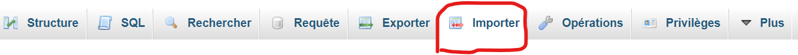

# Beethoven API

You need :
- <strong>PHP8</strong>
- <strong>A MySQL server</strong>
- <strong>Git</strong>

---

Install (in command line) :
``` 
git clone https://github.com/Sivarth91/BeethovenAPI
cd BeethovenAPI
```

---

This API is my first and it is not optimised but I wanted to share with you my work.

In the datbase, you have differents categories of work of Beethoven : 
- Symphonies
- Concertos
- Piano Sonatas
- Violin Sonatas
- Piano Trios
- Strings Trios
- Strings Quartets
- Others
 
In the database, in the works, you have differents informations about the work :
- id
- opus number
- title
- tone
- instruments
- years
- category

---

<strong>In PHPMyAdmin, import ```beethoven_sworks.sql``` like below and select the file.</strong>
</img>

---

<strong>Setup for :</strong>

- <strong>Wampserver64</strong>

Move your API folder in the wampserver64 application folder :
```
C:\wamp64\www\
```
and enter in your browser : 
```
localhost/BeethovenAPI/API
```

- <strong>Xampp</strong>

Move your API folder in the xampp application folder :
```
C:\xampp\htdocs
```
and as I don't use xampp, I don't know how to do it, so see for yourself ;) .

---

Access to informations made available by the API :

You can filter the informations you want to have. You can have all the informations, or you can filter the informations by categories or by id. To do this, enter in your browser :

- All
```
localhost/BeethovenAPI/API/works
```

- By categories
```
localhost/BeethovenAPI/API/works/symphonies
```

- By id :
```
localhost/BeethovenAPI/API/work/13
```
(Symphonies and 13 are examples, you could very well have taken concertos or 46. Please refer to the categories above for more informations)

---

